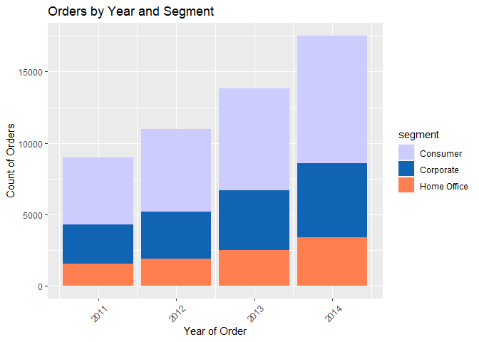
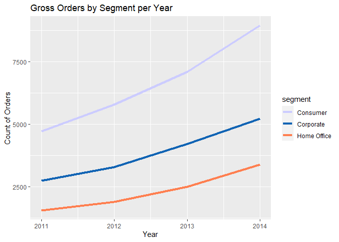
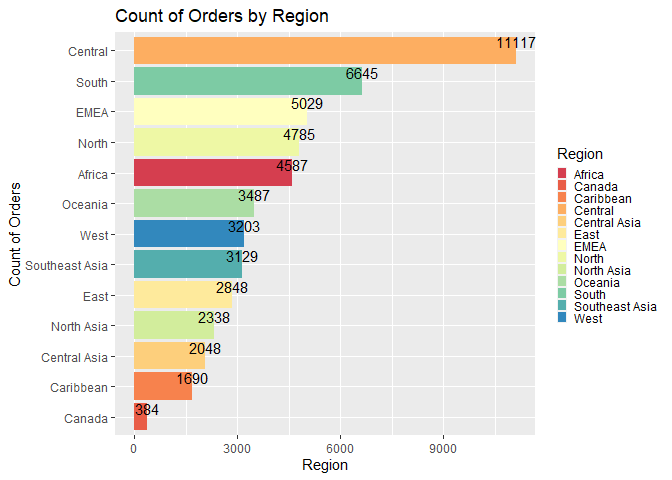
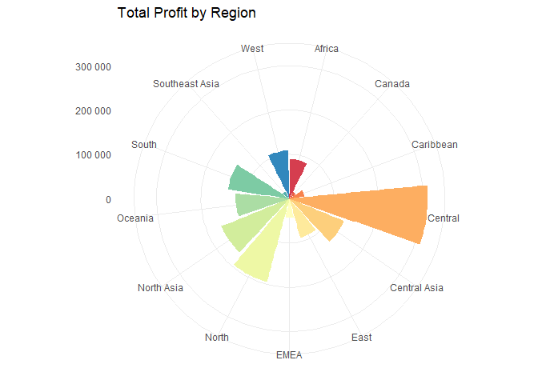
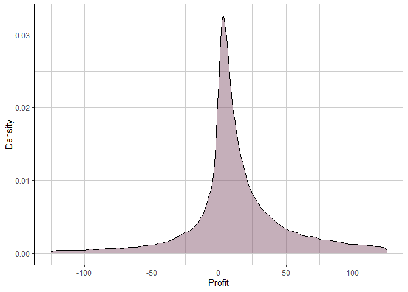
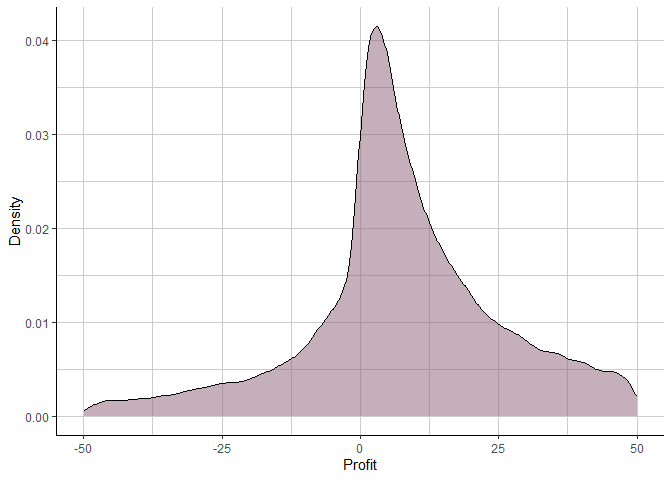

Turley_Project/HW_02
================
sally_turley
2023-03-02

``` r
data_path <- file.path(getwd(),"Project02_SuperStoreOrders.csv")
superstore <- read.csv(data_path)
```

# Q1 Create a Summary Statistic

``` r
summary(superstore)
```

    ##    order_id          order_date         ship_date          ship_mode        
    ##  Length:51290       Length:51290       Length:51290       Length:51290      
    ##  Class :character   Class :character   Class :character   Class :character  
    ##  Mode  :character   Mode  :character   Mode  :character   Mode  :character  
    ##                                                                             
    ##                                                                             
    ##                                                                             
    ##  customer_name        segment             state             country         
    ##  Length:51290       Length:51290       Length:51290       Length:51290      
    ##  Class :character   Class :character   Class :character   Class :character  
    ##  Mode  :character   Mode  :character   Mode  :character   Mode  :character  
    ##                                                                             
    ##                                                                             
    ##                                                                             
    ##     market             region           product_id          category        
    ##  Length:51290       Length:51290       Length:51290       Length:51290      
    ##  Class :character   Class :character   Class :character   Class :character  
    ##  Mode  :character   Mode  :character   Mode  :character   Mode  :character  
    ##                                                                             
    ##                                                                             
    ##                                                                             
    ##  sub_category       product_name          sales              quantity     
    ##  Length:51290       Length:51290       Length:51290       Min.   : 1.000  
    ##  Class :character   Class :character   Class :character   1st Qu.: 2.000  
    ##  Mode  :character   Mode  :character   Mode  :character   Median : 3.000  
    ##                                                           Mean   : 3.477  
    ##                                                           3rd Qu.: 5.000  
    ##                                                           Max.   :14.000  
    ##     discount          profit         shipping_cost    order_priority    
    ##  Min.   :0.0000   Min.   :-6599.98   Min.   :  0.00   Length:51290      
    ##  1st Qu.:0.0000   1st Qu.:    0.00   1st Qu.:  2.61   Class :character  
    ##  Median :0.0000   Median :    9.24   Median :  7.79   Mode  :character  
    ##  Mean   :0.1429   Mean   :   28.64   Mean   : 26.38                     
    ##  3rd Qu.:0.2000   3rd Qu.:   36.81   3rd Qu.: 24.45                     
    ##  Max.   :0.8500   Max.   : 8399.98   Max.   :933.57                     
    ##       year     
    ##  Min.   :2011  
    ##  1st Qu.:2012  
    ##  Median :2013  
    ##  Mean   :2013  
    ##  3rd Qu.:2014  
    ##  Max.   :2014

#### Analysis

The data show that the data is clean and does not have an abundance of
NA entries that would require us to remove them from the data in order
to begin our assessment. In fact, there are none that I can identify.
All of the data has the same length so we are able to manipulate it
easily.

The data ranges from 2011 to 2014 and examines the sales, quantity
purchased, discounts recieved, profits earned, shipping costs and the
urgency (priority) assisgned to the order. The table provides valuable
insights into the sales performance and trends, such as the sales
amount, profit, and shipping cost for each order, as well as the
frequency of orders over time.

# Q2 Orders Over Time by Segment

<!-- -->

# Q3 Which segment is the best seller?

We can compare segments by calculating the proportion of sales per
segment both yearly and overall. This way we might be able to see
changes over time in the growth or decline of various sectors.

<!-- -->

# Q4 Bar Chart of Regional Orders

<!-- -->

#### Analysis

The region that receives the most orders is the Central region, while
Canada receives the least with only 384. The main issue with this
information is the terms that are used to identify the regions are
nonsensicle and require another legend to decipher.

The regions of the united states that are represented (presumably) by
the terms North, East, South, Central and West, are significantly larger
in aggregate than any of the other regions. I would be interested to see
where central american countries like Mexico would be placed.

Overall this demonstrates that the US, and the Central region in
particular (if my assumptions about the naming conventions are correct)
are the largest regions by sales order count.

# Q5 Using the Snippet, create the profits graph

    ## 
    ## Attaching package: 'scales'

    ## The following object is masked from 'package:purrr':
    ## 
    ##     discard

    ## The following object is masked from 'package:readr':
    ## 
    ##     col_factor

<!-- -->

This further shows that the total orders from the are related to total
profit. to what extent this relationship exists is for another time.

# Q6 Density Plot

``` r
density_data <- density(subset_data$profit)
denser_data <- density(smaller_subset$profit)
```

``` r
density_df <- data.frame(x = density_data$x, y = density_data$y)
smaller_density_df <- data.frame(x = denser_data$x, y = denser_data$y)

ggplot(subset_data, aes(x = profit)) +
  geom_density(aes(y = ..density..), fill = "#8B5F75", alpha = 0.5) +
  scale_y_continuous(name = "Density", labels = comma) +
  scale_x_continuous(name = "Profit", labels = comma) +
  theme_classic() +
  theme(panel.grid.minor = element_line(color = "gray80", linetype = "solid")) +
  theme(panel.grid.major = element_line(color = "gray80", linetype = "solid"))
```

    ## Warning: The dot-dot notation (`..density..`) was deprecated in ggplot2 3.4.0.
    ## ℹ Please use `after_stat(density)` instead.

<!-- -->

``` r
ggplot(smaller_subset, aes(x = profit)) +
  geom_density(aes(y = ..density..), fill = "#8B5F75", alpha = 0.5) +
  scale_y_continuous(name = "Density", labels = comma) +
  scale_x_continuous(name = "Profit", labels = comma) +
  theme_classic() +
  theme(panel.grid.minor = element_line(color = "gray80", linetype = "solid")) +
  theme(panel.grid.major = element_line(color = "gray80", linetype = "solid"))
```

<!-- -->

#### Analysis

This graph shows only the individual order profits that are between -125
and 125. What we can see is that though the profits lie around 0 (as we
would expect of a normally distributed data set) there is a strong pull
towards positive profits. The kurtosis that we see with this graph
however is quite large and is very close to 1. This may suggest that
some inventory items might not be profitable and that the mix of items /
services that are provided could be assessed.

Because we are only looking at the data between -125 and 125 are
amplifying our ability to see the smaller shifts around zero that might
otherwise be flattened by densities with more data points included.

Profits are being made by this company, but not on every order. While
this is not ideal, to the extent that it is impacting the companies
ability to operate effectively is not self-evident from this graph
alone. The most dense areas of the graph here are hovering between 5 and
15. The skew to the right is a good sign that indicates that there are
inefficiencies in product mix or employee staffing that could help bring
the mean profit even higher than \$28 per order.

The main reason why representing the density is helpful here (bounded)
is it allows the profit to be assessed independent of the outlines that
are frequently the main attraction in business setting.
